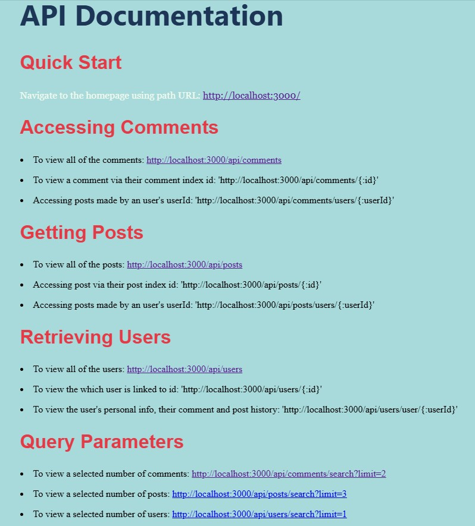

# Project Name
### Skill Based Assessment #6 --- <em> Express Server Application </em>

- - - -

## Project Description
### Create a RESTful web application using the fundamentals of Node.js and Express.js. Creative freedom is a go, topic is totally up for grasp. Main objectives includes ...

#### 1. Creating a server application with Node.js and Express.js.
#### 2. Create a RESTful API using Express.js.
#### 3. Create some Express middleware functions.
#### 4. Use the Express middleware functions (whether in callback functions for path routes or independently).
#### 5. Use a template engine (create or use a 3rd party) to render views with Express.
#### 6. Interact with a self-made API through HTML forms. *

- - - -

## Technologies used
### JavaScript runtime environments:
#### (1) Browser (Chrome, Edge, etc.)
#### (2) Node.js (built-in JavaScript):
##### HTTP request methods (POST, GET, PUT, PATCH, DELETE), HTTP responses, app.listen()  and other methods

### Express() route path handlers: 
#### structure: app.method(path URL, *callback* handler function *middleware* )
#### methods: POST (app.post), GET (app.get), PATCH (app.patch), DELETE (app.delete) routes
#### properties: app.use() -- to load router, 

### Express Router():
#### structure: router.method(path URL, *callback* handler function)
#### methods: POST (router.post), GET (router.get), PATCH (router.patch), DELETE (router.delete), express.router()

### Form validation for URL pathname
#### Regular functions (Regex): () *capture*, ? *optional*, * *catch all* 
#### Used with route paths so "comment" or "comments" plural could both work when inputted

### Express route parameters:
#### req.params { userId:"1", id: "1" }

### Express middlewares (order matters)
#### logging, error-handling (4 params req.), 3rd party (Morgan, etc.), express.static(), app.use() & next() -- handle middleware

### Body-Parser
#### import JavaScript middleware to parse out data
#### bodyParser.urlenencoded(), bodyParser.json()

### Additional Express methods
#### .json(), .Router(), .static(), .urlencoded()

### HTTP request / response object properties
#### req.params, res.send(), req.path, res.status(), res.json()

### Query parameters for data filtration
#### req.query()

### File System (fs.readFile)
#### import built-in node file system to allow handling of template engine

### Template engine
#### app.use()      -- to load it onto server.mjs 
#### app.set()      -- specifies file & registers view engine
#### express.static -- to load stylesheets to template engine
#### res.render()   -- render view to be sent back to client

### JavaScript built-in objects, methods
#### .toString(), .replace(), .replaceAll(), .push(), .find()

### JS containers, conditionals, loops
#### arrays [], objects {}, if-else, while()

### CSS external styling
### import / export modular JS files
### npm, nodemon, install express packages, node_modules + .gitignore,

* Others: Github add, commits; JS package, VSCode IDE, Thunder-Client extension

- - - -

## How to get started
### Functionality over form
### Hit the minimum requirements (Create a Minimum Viable Product) first. Looked over the lecture slides and read through the notes to refresh some of the concepts. Start commiting early and frequently save. 
### Once again --- functionality first & creativity later.

- - - -

## Acknowledgements
### All used source materials are stored in the "reference folder of this repo.

### One Piece Wiki
#### https://onepiece.fandom.com/wiki/One_Piece_Wiki

### One Piece image links
#### https://www.deviantart.com/bodskih/art/Sanji-Vinsmoke-685896296
#### https://www.deviantart.com/inkartluis/art/TONY-TONY-CHOPPER-from-One-Piece-812369010
#### https://onepiece.fandom.com/wiki/Usopp

### Popular color schemes
#### https://coolors.co/palettes/popular

### Emojis
#### https://emojipedia.org/waving-hand

### Express middlewares resources
#### https://expressjs.com/en/resources/middleware.html
#### https://retrodevs.medium.com/express-js-logger-middleware-a-quick-and-easy-guide-6b79a14ea164

### Express 3rd party middleware: Morgan
#### https://stackoverflow.com/questions/25468786/what-does-morgan-module-have-to-do-with-express-apps#:~:text=For%20example%3A%20var%20express%20%3D%20require%28%27express%27%29%20var%20morgan,in%20the%20%22combined%22%20pre-defined%20format%20app.use%28morgan%28%27combined%27%29%29%20%2F%2FThat%27s%20it.

### Express error-handling examples
#### https://expressjs.com/en/guide/error-handling.html

### Express .json() response method usage (JSON string to browser)
#### https://www.geeksforgeeks.org/express-js-res-json-function/

### JavaScript Object prototype (ways to check if obj is empty)
#### https://www.freecodecamp.org/news/check-if-an-object-is-empty-in-javascript/

### Regex syntaxes
#### https://developer.mozilla.org/en-US/docs/Web/JavaScript/Guide/Regular_expressions/Cheatsheet

### CSS animations
#### https://developer.mozilla.org/en-US/docs/Web/CSS/CSS_animations/Using_CSS_animations

### Markdown formatting & display image guides
#### https://www.markdownguide.org/basic-syntax/
#### https://stackoverflow.com/questions/41604263/how-do-i-display-local-image-in-markdown

### Lecture Notes
#### https://www.canva.com/design/DAFris1zDAc/view
#### https://www.canva.com/design/DAFripTTxwU/view
#### https://www.canva.com/design/DAFrihOC93k/EfbRohZDCpdHqOr5rKNxOg/edit


- - - -

### Setup
> First create the "server.mjs" file using git bash, then pass the npm command: <strong> "npm init -y" </strong> into the command line to create "package.json" file. Install nodemon globally on local machine if tool is missing via <strong> "npm i --save-dev nodemon" </strong>. Next, correct the package.json --- check the value of the "main" key is "server.mjs" (same name as the modular JS file we'll be working in) & add "start": "nodemon server.mjs" under scripts. Now, we create an ".gitignore" file ("node_modules/" line inside) so during git commits and ultimately git push, our node_module (could be big) would NOT be pushed to Github. Soonafter, download Express using <strong> "npm i express" </strong> command. Import Express into server.mjs at top of the page (import express from 'express'), create an instance of Express, and declare a PORT for the server to be listening to (default: 3000, 5500, etc.). Establish an app.listen() function at the very bottom of server.mjs and an app.get() function above typically taking in path URL of root and an arrow function of arguments (pair of request & response) with res.send() method. To see if the text is successfully broadcasted, run <strong> "npm start" </strong> in the command line and navigate to URL "http://localhost:3000/ on a browser or send an HTTP GET request to above URL on VS Code's Thunder-Client extension to just check it on the back-end.

### Enclosed Files
> <em> server.mjs </em>
- Holds the brains of the server, showcase outline of necessary imports, port to listen, template engine, middleware functions, routes, error-handling middleware, app.listen() function. 
</br/>

> <em> package.json </em>
>
> <em> package-lock.json </em>
- Created via <strong> npm init -y </strong> and its purpose is to manage required dependencies, scripts, and other information for this project to be operational.
</br>

> *.gitignore*
- Contains the single line <strong> node_modules/ </strong> (case-senstive) to withhold the node_modules file during git push to Github.
</br>

> *node_modules*
- Why exclude this node_modules file? It may be big & it holds extraneous data that others may not want to see.
</br>

> data
>> *comments.mjs*
>>
>> *posts.mjs*
>>
>> *users.mjs*
- Carry the three data categories created by myself, inspired by examples from lecture, as inquired.
</br>

> routes
>> *commentRoutes.mjs*
>>
>> *postRoutes.mjs*
>>
>> *userRoutes.mjs*
- Comprises of Router() files that uses their respective data files (sometimes addtional files) to perform HTTP requests (POST, GET, PATCH, DELETE, etc.) separately. Why? Practice separation of concerns, later import them into the server.mjs.
</br>

> utilities-middleware
>> *custom_error.mjs*
>>
>> *custom_logger.mjs*
>>
>> custom_req_logger.mjs*
- Middleware handler functions to be used either in "routes" or in "server.mjs", here we mainly call them into "server.mjs" via **app.use()**.
</br>

> views
>> *template.who*
- Template engine to be used in server.mjs, serves as outline for each of the web app produced on the browser when running.
</br>

> styles
>> *styles.css*
<ul>
<li> CSS provides styling to the endpoints.html and later crucial in serving static files in an Express application for the template.who template engine. </li>
</ul>
</br>

> *images*
- Consists of all the images used in the template engine.
</br>

> *references*
- Holds reference materials ncessary for completion of this project.
</br>

> endpoints
>> *endpoints.html*
>> *endpoints.txt*
- Felt like my original template might not provide enough information regardng the endpoints of the this Express server application. Wasn't sure if I could have two templates for one server.mjs. Therefore, I created a side html file showing a deeper dive (more endpoints) for the this server app. However when I first redirected to it via an anchor tag/link, it opened on PORT 5500 not on PORT 3000 like server.mjs. 
- **<u>Side Note</u>: Might have to "Open with Live Server" the *"endpoints.html"* before redirecting to it via link from http://localhost:3000 for it to operational.**
- Aside: "endpoints.txt" there just in case.
</br>

### Directions
#### With the assumption that "npm start" is already active, navigate to **http://localhost:3000/**. Upon establishing successful connection, there would be an CSS animation that pops out the title status page showing the user where they are currently at. Right underneath the status page would be a link to the documentation page. Below all of that would be a blurred image of some pirate, their name, bounty, etc. Unveiling the CSS styling, images, and such was served from the express.static() method in server.mjs. Notice, the particular format of the elements on the page is identical to the format in given by the template engine "template.who" in our case. Mouse over the div container would uncover the content.

> Clicking the "Link to Documentation" (from homepage) would redirect to **localhost:3000/documentation** which informs about a few of the possible endpoints with this Express web app. 
>> #### '/api/comments' endpoint shows all of the comments in the database
>>> **http://localhost:3000/api/comments** 
>> #### '/api/posts' endpoint shows all of the posts in the database
>>> **http://localhost:3000/api/posts**
>> #### '/api/users' endpoint shows all of the users in the database
>>> **http://localhost:3000/api/users**
>>

#### (Attempt at RESTful by providing documentation) Now on **localhost:3000/documentation**, selecting *"Link to Documentation"* would move you to **http://127.0.0.1:5500/endpoints/endpoints.html** (if it's running via Live Server already). There it shows a comprehensive breakdown on how to get multiple comments and posts, filtering out comments and posts by their individual index id.
>> #### Shows the comment with id of '1' and options availables (PATCH, DELETE) all in an object of array for options
>>> **http://localhost:3000/api/comments/1** 
>> #### Portrays the post with id of '1' and option to PATCH (update) or DELETE (remove) in object
>>> **http://localhost:3000/api/posts/1** 
>> #### Displays the user by their userId of '1' with similar options to above
>>> **http://localhost:3000/api/users/1** 
</br>
- - - 
- In the case, the post, comment, or user of certain id is not available only the array of options would follow show. Indicating that despite there not being one a comment, post, or user data it could be filled and created. See Thunder-Client notes block below for more.
```
{
    "options": [
        {
            "href": "/fgfg",
            "rel": "",
            "method": "PATCH"
        },
        {
            "href": "/fgfg",
            "rel": "",
            "method": "DELETE"
        }
    ]
}
```
- - - 

> Simultaneously, could shuffle out comment and post history for a certain individual under their userId. 
>> #### Note: An intermediate '/user endpoint was placed afer '/api/comments
>>> **http://localhost:3000/api/comments/user/1**
>> #### Note: An intermediate '/user endpoint was placed afer '/api/posts
>>> **http://localhost:3000/api/posts/user/1**
>> #### Note: An intermediate '/user endpoint was placed afer '/api/users
>>> **http://localhost:3000/api/users/user/1**
</br>

>If the individual does NOT exist, an error-handling middleware on the backend would be invoked and return a JSON string of object {} showing the status of "404" (status code for when resource is not found) and the specific error of particular data not found. <em> (<u>Aside</u>: Managed to dynamically change the custom error message depending on HTTP GET requested path but it made it look aesthetically unpleasing & broke separation of concerns so reverted back.) </em>
```
{
    "status": "404",
    "error": "Data not found"
}
```

> Under the guise user accidentally inputted **http://localhost:3000/api** rather than any of the viable endpoints, a picture of Tony Tony Chopper would ensue and ... of course you guess it. A link to the documentation.

> Under the rare circumstance when user mistakenly placed an invalid endpoint by a wide margin, there is a HTTP get request using regex symbol '*' to catch all other paths that are goes nowhere. Consequently, a string would pop out on the browser of the path not existing and kindly redirects **localhost:3000/documentation**.

> By the way, regular expressions (regex: () and ?) are used for the below path URL:
>> **http://localhost:3000/api/comments** 
>>
>> **http://localhost:3000/api/posts** 
>>
>> **http://localhost:3000/api/users** 
</br>

> such that the three URL's below would redirect to the same page as the three URL paths above.
>> **http://localhost:3000/api/comment** 
>>
>> **http://localhost:3000/api/post** 
>>
>> **http://localhost:3000/api/user** 


### Thunder-Client (CRUD works here -- testing backend w/o needing front-end)
> #### Using **Thunder-Client**, all the previous HTTP GET requests could be done here. On top of PATCH to update an existing comment, post, user OR DELETE to remove a comment, post, user. Furthermore, POST method to create a new comment, post, user is available too.

> #### This could be done by first selecting the wanted method (GET, POST, PATCH, DELETE). Input URL path to be accessed, if for GET no need to do anymore and just "send" it to show relevant data.

> #### If for POST, PATCH, or DELETE method. Select wanted method, input URL path, go to "Body" tab and then either "JSON" if want to input it in the format following container setup and such in the database (array, objects, etc.). Other option is "Form-encode" where just fill in "name" (key) and "value" (value) fields and it will still be placed in an object. 

> #### Ex. Updating a comment example by their index id
>>1. POST
>>2. http://localhost:3000/api/comments/1
>>3. JSON
>>4.    
``` 
{
    "id": 3,
    "userId": 50,
    "title": "keke",
    "content": "dfdddd@keke.com"
}
```
>>5. Send
>>6. GET http://localhost:3000/api/comments SEND  --- to see results


### Query Parameters -- Data Filtering
> Useful in pagination (break big data into small chunks) when a database is ginormous and you want to just filter the dataset for wanted values.
> Note: Query parameters conventional syntax is starting with a question mark '?' and using ampersands '&' to concatenate multiples. As follows:
> - #### /search?limit=2
>> - returns a JSON string array of 2 comments to browser
>> http://localhost:3000/api/comments/search?limit=2
</br> 

>> - returns a JSON string array of 3 posts to browser
>> http://localhost:3000/api/posts/search?limit=3
</br>

>> - returns a JSON string array of 1 user to browser
>> http://localhost:3000/api/users/search?limit=1